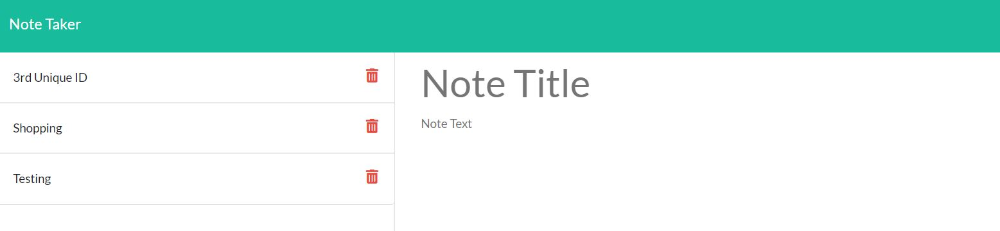

#  Note Taker


## 📝 Description
```
The Note Taker is a Node/Express JS application that allows you to create and save notes. The notes are saved on the back-end in a file with the JSON format. 

When the application is re-visited, the prior notes are loaded. You also have the option to delete any existing note.
```

## 🧰 Technologies Used

* `Express Node.js`
* `npm (Node Package Manager)`
* `Javascript`
* `Inquirer`
* `Bootstrap`
* `Font-Awesome`
* `UUID Package`

## 📄 Installation Instructions

You will need to install the latest version of [Node](https://nodejs.org/en/), [Inquirer](https://www.npmjs.com/package/inquirer), the [UUID](https://www.npmjs.com/package/uuidv4) package as well as installing [Express.js](https://expressjs.com/) using the Node Package Manager.

## 🤸‍♂️ Challenges/Successes
* Styling on the front-end with a custom css file and code for the client-side javascript file weren't working correctly with the included starter code.
  * Used Express as a middleware to include a static path to the assets folder on the client side to allow correct linking to the custom css and js files.
* Generating a unique id to give the application a way to track which note the user clicked on for deletion purposes.
  * Included the UUID package and generated a unique id for storage. Used this ID as a parameter when a Delete request was sent back to the server.


## 📸 Screenshots

 > Below are screenshots of the deployed application.




## 📱 Contact 

Malcolm Mason - [Github](https://github.com/malmason) Email: [Malcolm](mailto:malmason66@gmail.com) 📧

---

&copy; 2021 Malcolm Mason